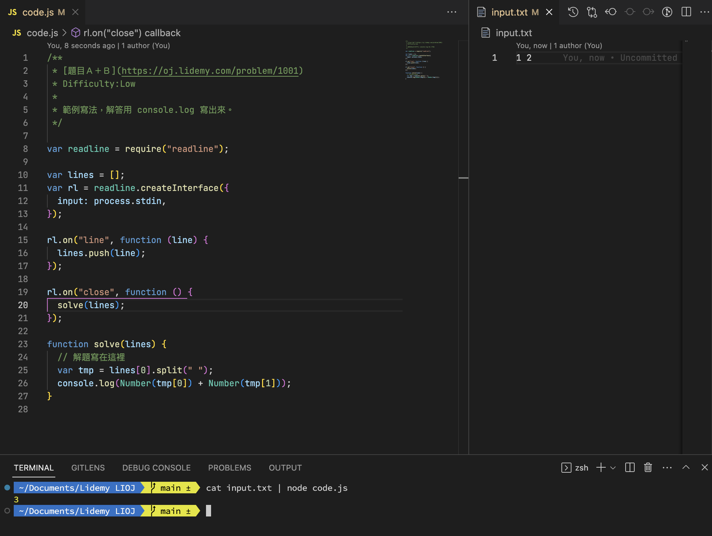

# LidemyOJ(LIOJ)

執行 `cat input.txt | node code.js`

或是這樣

```
~ node code.js. // 直接執行
~ 1 2           // 輸入值
~ ctrl + D      // 看看答案是不是對的
```



`
| # | Problem | Solution | Description |
|---| ------- | -------- | --- |
|1001|[題目Ａ＋Ｂ](https://oj.lidemy.com/problem/1001)|[JavaScript](https://github.com/roroiii/LidemyOJ/blob/main/javascript/1001.js)
|1002|[數字比大小](https://oj.lidemy.com/problem/1002)|[JavaScript](https://github.com/roroiii/LidemyOJ/blob/main/javascript/1002.js)
|1003|[聯誼門票搶起來](https://oj.lidemy.com/problem/1003)|[JavaScript](https://github.com/roroiii/LidemyOJ/blob/main/javascript/1003.js)|比較大位數字|
|1004|[聯誼順序比大小](https://oj.lidemy.com/problem/1004)|[JavaScript](https://github.com/roroiii/LidemyOJ/blob/main/javascript/1004.js)
|1005|[聯誼話題相親數](https://oj.lidemy.com/problem/1005)|[JavaScript](https://github.com/roroiii/LidemyOJ/blob/main/javascript/1005.js)
|1006|[聯誼坐法排排看](https://oj.lidemy.com/problem/1006)|
|1007|[聯誼排行大比拼](https://oj.lidemy.com/problem/1007)|[JavaScript](https://github.com/roroiii/LidemyOJ/blob/main/javascript/1007.js)
|1008|[幾個水桶](https://oj.lidemy.com/problem/1008)|[JavaScript](https://github.com/roroiii/LidemyOJ/blob/main/javascript/1008.js)|二元運算|
|1009|[Yo！倒著唸！](https://oj.lidemy.com/problem/1009)|[JavaScript](https://github.com/roroiii/LidemyOJ/blob/main/javascript/1009.js)
|1010|[靈魂伴侶](https://oj.lidemy.com/problem/1010)|[JavaScript](https://github.com/roroiii/LidemyOJ/blob/main/javascript/1010.js)
|1011|[183 Club](https://oj.lidemy.com/problem/1011)|[JavaScript](https://github.com/roroiii/LidemyOJ/blob/main/javascript/1011.js)
|1012|[買一送一](https://oj.lidemy.com/problem/1012)|[JavaScript](https://github.com/roroiii/LidemyOJ/blob/main/javascript/1012.js)
|1013|[搭電梯](https://oj.lidemy.com/problem/1013)|
|1014|[不九人世](https://oj.lidemy.com/problem/1014)|
|1015|[音速小子](https://oj.lidemy.com/problem/1015)|[JavaScript](https://github.com/roroiii/LidemyOJ/blob/main/javascript/1015.js)
|1016|[不合群的人](https://oj.lidemy.com/problem/1016)|[JavaScript](https://github.com/roroiii/LidemyOJ/blob/main/javascript/1016.js)
|1017|[貪婪的小偷](https://oj.lidemy.com/problem/1017)|[JavaScript](https://github.com/roroiii/LidemyOJ/blob/main/javascript/1017.js)
|1018|[大平台](https://oj.lidemy.com/problem/1018)|[JavaScript](https://github.com/roroiii/LidemyOJ/blob/main/javascript/1018.js)
|1019|[一條路走到黑](https://oj.lidemy.com/problem/1019)|
|1020|[判斷質數](https://oj.lidemy.com/problem/1020)|[JavaScript](https://github.com/roroiii/LidemyOJ/blob/main/javascript/1020.js)
|1021|[好多星星](https://oj.lidemy.com/problem/1021)|[JavaScript](https://github.com/roroiii/LidemyOJ/blob/main/javascript/1021.js)
|1022|[印出金字塔](https://oj.lidemy.com/problem/1022)|[JavaScript](https://github.com/roroiii/LidemyOJ/blob/main/javascript/1022.js)
|1023|[印出聖誕樹](https://oj.lidemy.com/problem/1023)|[JavaScript](https://github.com/roroiii/LidemyOJ/blob/main/javascript/1023.js)
|1024|[NM 乘法表](https://oj.lidemy.com/problem/1024)|[JavaScript](https://github.com/roroiii/LidemyOJ/blob/main/javascript/1024.js)
|1025|[NM 乘法表](https://oj.lidemy.com/problem/1025)|[JavaScript](https://github.com/roroiii/LidemyOJ/blob/main/javascript/1025.js)
|1026|[判斷等比數列](https://oj.lidemy.com/problem/1026)|[JavaScript](https://github.com/roroiii/LidemyOJ/blob/main/javascript/1026.js)
|1027|[信用卡號驗證](https://oj.lidemy.com/problem/1027)|[JavaScript](https://github.com/roroiii/LidemyOJ/blob/main/javascript/1027.js)
|1028|[生命靈數](https://oj.lidemy.com/problem/1028)|[JavaScript](https://github.com/roroiii/LidemyOJ/blob/main/javascript/1028.js)
|1029|[加減乘除](https://oj.lidemy.com/problem/1029)|[JavaScript](https://github.com/roroiii/LidemyOJ/blob/main/javascript/1029.js)
|1030|[判斷迴文](https://oj.lidemy.com/problem/1030)|[JavaScript](https://github.com/roroiii/LidemyOJ/blob/main/javascript/1030.js)
|1031|[完全平方和](https://oj.lidemy.com/problem/1031)|[JavaScript](https://github.com/roroiii/LidemyOJ/blob/main/javascript/1031.js)
|1032|[平面距離計算](https://oj.lidemy.com/problem/1032)|[JavaScript](https://github.com/roroiii/LidemyOJ/blob/main/javascript/1032.js)
|1033|[最近點對](https://oj.lidemy.com/problem/1033)|
|1034|[凱薩加密](https://oj.lidemy.com/problem/1034)|
|1035|[簡易排序](https://oj.lidemy.com/problem/1035)|
|1036|[Array reverse](https://oj.lidemy.com/problem/1036)|[JavaScript](https://github.com/roroiii/LidemyOJ/blob/main/javascript/1036.js)
|1037|[Array filter](https://oj.lidemy.com/problem/1037)|[JavaScript](https://github.com/roroiii/LidemyOJ/blob/main/javascript/1037.js)
|1038|[Array indexOf](https://oj.lidemy.com/problem/1038)|[JavaScript](https://github.com/roroiii/LidemyOJ/blob/main/javascript/1038.js)
|1039|[Array fill](https://oj.lidemy.com/problem/1039)|[JavaScript](https://github.com/roroiii/LidemyOJ/blob/main/javascript/1039.js)
|1040|[Array join](https://oj.lidemy.com/problem/1040)|[JavaScript](https://github.com/roroiii/LidemyOJ/blob/main/javascript/1040.js)
|1041|[String trim](https://oj.lidemy.com/problem/1041)|[JavaScript](https://github.com/roroiii/LidemyOJ/blob/main/javascript/1041.js)
|1042|[String toLowerCase](https://oj.lidemy.com/problem/1042)|[JavaScript](https://github.com/roroiii/LidemyOJ/blob/main/javascript/1042.js)
|1043|[String endsWith](https://oj.lidemy.com/problem/1043)|[JavaScript](https://github.com/roroiii/LidemyOJ/blob/main/javascript/1043.js)
|1044|[String padEnd](https://oj.lidemy.com/problem/1044)|[JavaScript](https://github.com/roroiii/LidemyOJ/blob/main/javascript/1044.js)
|1045|[String slice](https://oj.lidemy.com/problem/1045)|[JavaScript](https://github.com/roroiii/LidemyOJ/blob/main/javascript/1045.js)
|1046|[圈圈叉叉](https://oj.lidemy.com/problem/1046)|[JavaScript](https://github.com/roroiii/LidemyOJ/blob/main/javascript/1046.js)
|1047|[搜尋數字](https://oj.lidemy.com/problem/1047)|[JavaScript](https://github.com/roroiii/LidemyOJ/blob/main/javascript/1047.js)
|1048|[最大連續和](https://oj.lidemy.com/problem/1048)|
|1049|[陣列最短距離](https://oj.lidemy.com/problem/1049)|
|1050|[Two sum](https://oj.lidemy.com/problem/1050)|[JavaScript](https://github.com/roroiii/LidemyOJ/blob/main/javascript/1050.js)
|1051|[逆序數對](https://oj.lidemy.com/problem/1051)|[JavaScript](https://github.com/roroiii/LidemyOJ/blob/main/javascript/1051.js)|Merge sort 合併排序|
|1052|[貪婪的小偷 Part2](https://oj.lidemy.com/problem/1052)|[JavaScript](https://github.com/roroiii/LidemyOJ/blob/main/javascript/1052.js) |Depth First Search 深度優先搜尋|
|1053|[走迷宮](https://oj.lidemy.com/problem/1053)|
